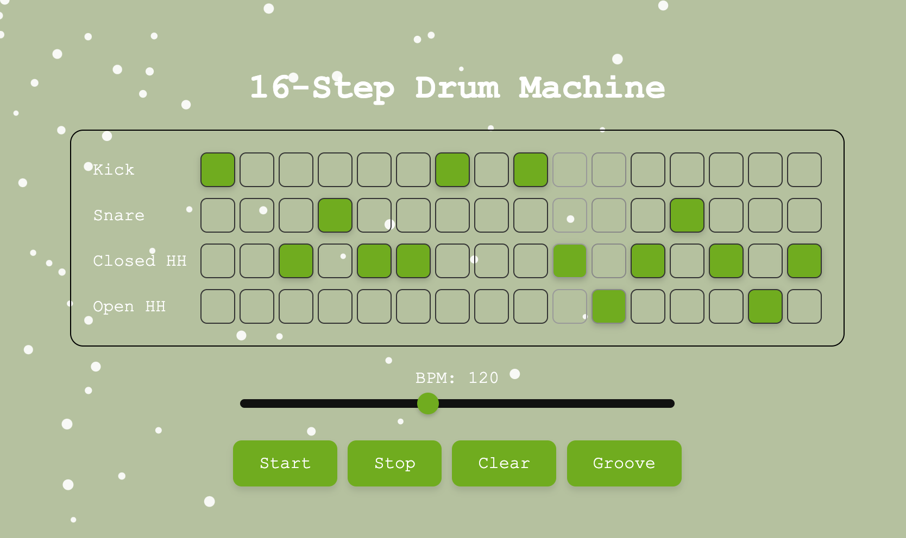

# Basic Drum Sequencer
A lightweight browser-based drum sequencer built using [Tone.js](https://tonejs.github.io/)

## Demo
Have a play [here](https://oliverkiranbrown.github.io/drum_sequencer/)!

## Description
This mini-project stores three drum grooves in memory and lets you dynamically modify the patterns on the fly. Tiny animated particles move across the screen and respond to your mouse, for some fun visual interest. 

This will form the basis of a more exciting project planned in the future...

### Features
- Three preset drum grooves
- Real-time pattern editing
- Interactive particle animations

### Built With
- [Tone.js](https://tonejs.github.io/)
- HTML, CSS, JavaScript
